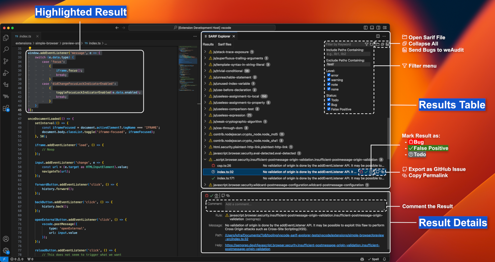
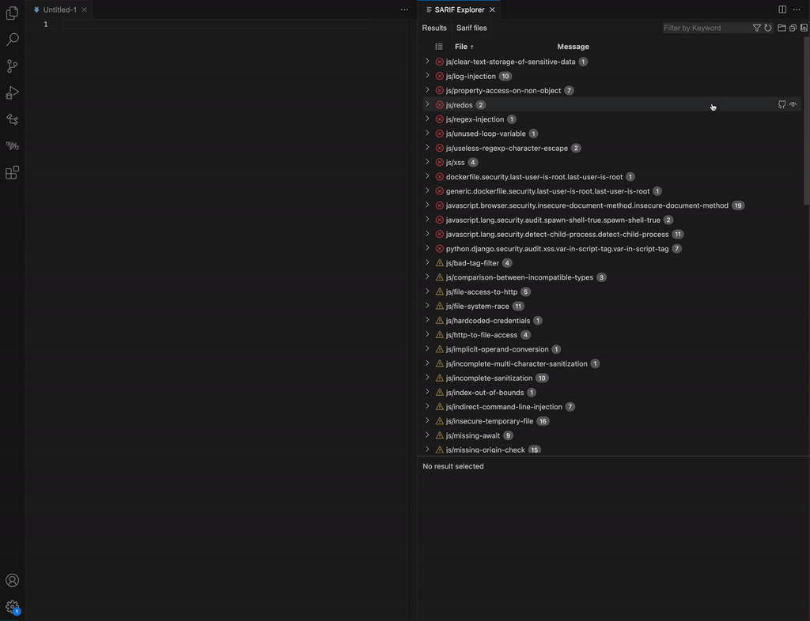
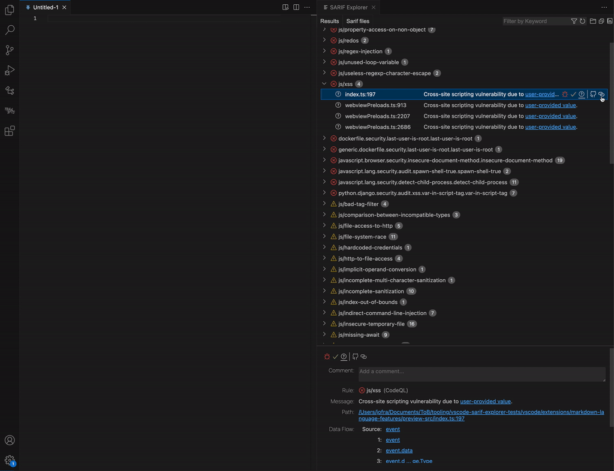
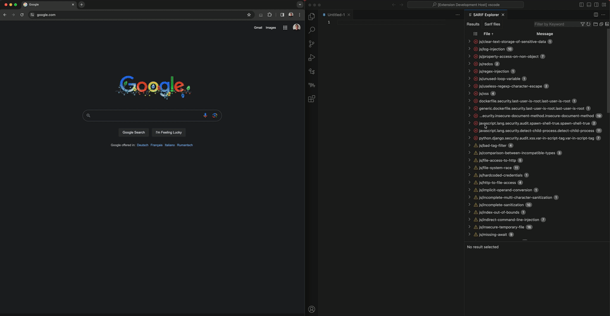
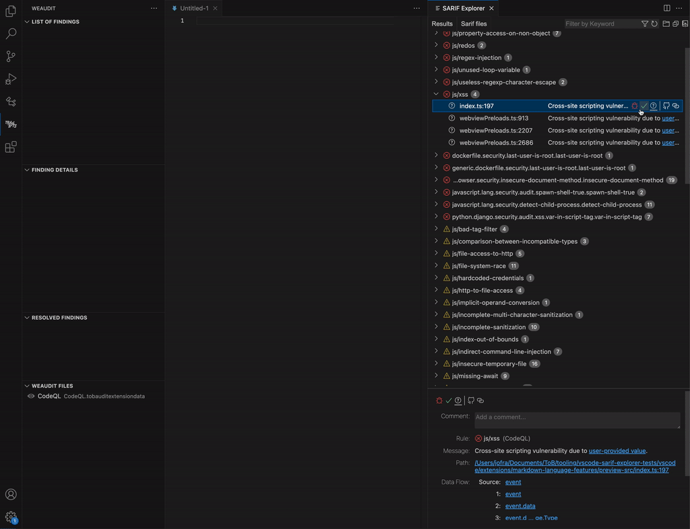

<!-- Cannot use SVG because of the VSCode extension packager :cries: -->
<!-- trunk-ignore-all(markdownlint/MD041) -->

<picture>
  <source media="(prefers-color-scheme: dark)" srcset="https://raw.githubusercontent.com/trailofbits/vscode-sarif-explorer/main/media/banner-dark-mode.png">
  <source media="(prefers-color-scheme: light)" srcset="https://raw.githubusercontent.com/trailofbits/vscode-sarif-explorer/main/media/banner-light-mode.png">
  
</picture>

# SARIF Explorer: Enjoy reviewing your static analysis results

SARIF Explorer is a VSCode extension that enables you to review static analysis results effectively and enjoyably. No more browsing `.txt` or `.csv` files.


Whether you are a developer or a code auditor, SARIF Explorer allows you to classify your tool's results as `Bug` or `False Positive`, add comments to the results, export the bugs you triaged, and much more (see [Features](#features) below).




## Installation

Install the extension by searching for [SARIF Explorer](https://marketplace.visualstudio.com/items?itemName=trailofbits.sarif-explorer) in the VSCode Extensions browser. See the [Build and install](#development) section below for how to build and install from code.


## Features

  - [**Open Multiple SARIF Files**](#open-multiple-sarif-files): Open and browse the results of multiple SARIF files simultaneously.
  - [**Browse Results**](#browse-results): Browse results by clicking on them, which will open their associated location in VSCode. You can also browse a result's dataflow steps, if present.
  - [**Classify Results**](#classify-results): Add metadata to each result by classifying them as a `Bug`, `False Positive`, or `Todo`, and adding a custom text comment.
  - [**Filter Results**](#filter-results): Filter results by keyword, path (to include or exclude), level (`error`, `warning`, `note`, or `none`), and status (`Bug`, `False Positive`, or `Todo`). You can also hide all results from a specific SARIF file or from a specific rule.
  - [**Copy GitHub Permalinks**](#copy-github-permalinks): Copy a GitHub permalink to the location associated with a result. Requires having [weAudit](https://github.com/trailofbits/vscode-weaudit) installed.
  - [**Create GitHub Issues**](#create-github-issues): Create formatted GitHub issues for a specific result or for all the un-filtered results under a given rule. Requires having [weAudit](https://github.com/trailofbits/vscode-weaudit) installed.
  - [**Send Bugs to weAudit**](#send-bugs-to-weaudit): Send all results classified as `Bug` to [weAudit](https://github.com/trailofbits/vscode-weaudit) (results are automatically de-duplicated). Requires having [weAudit](https://github.com/trailofbits/vscode-weaudit) installed.
  - [**Collaborate**](#collaborate): Share the `.sarifexplorer` file with your colleagues (e.g., on GitHub) to share your comments and classified results.


## Suggested Work Flow

  1. Run all of your static analysis tools and store the resulting SARIF files in the folder where you ran them
  2. Open SARIF Explorer and open all the SARIF files
  3. Filter out the noisy results:
     - Are there rules that you are not interested in seeing? Hide them!
     - Are there folders for which you don't care about the results (e.g., the `./tests` folder)? Filter them out!
  4. Triage the results:
     - determine if each result is a false positive or a bug
     - swipe left or right accordingly (i.e., click the left or right arrow)
     - add additional context with a comment if necessary
  5. Working with other team members? Share your progress by committing the [`.sarifexplorer` file](./docs/sarif_explorer_spec.md)
  6. Send all results marked as bugs to [weAudit](https://github.com/trailofbits/vscode-weaudit) and proceed with the [weAudit](https://github.com/trailofbits/vscode-weaudit) workflow


## Concepts

  - **SARIF Files**: The SARIF files you've opened that can be viewed in the `SARIF Files` tab.
  - **Results**: The results loaded from the SARIF Files that can be viewed in the `Results` tab.
  - **Base Folder**: The absolute path of the folder against which you ran your static analysis tool. SARIF Explorer uses this path to know where to open a result's associated code. In most situations, SARIF Explorer's heuristics will automatically find this folder for you.


## Keybindings

In the `Results` tab:
  - `ArrowDown`: Select the result below
  - `ArrowUp`: Select the result above
  - `ArrowRight`: Classify the selected result as a `Bug` and select the result below
  - `ArrowLeft`: Classify the selected result as a `False Positive` and select the result below
  - `Backspace`: Classify the selected result as `Todo` and select the result below


---


### Open Multiple SARIF Files

Open multiple files by clicking the  button in the top bar and selecting multiple SARIF files. You can browse the list of opened SARIF files in the `SARIF Files` tab, where you can also close or reload a given SARIF file.

In the detailed view of the SARIF file, you can see its full path, the number of results it found, and which rules it ran on the code even if no results were found with that rule (if the tool produces a correct SARIF file). In this view, you can also modify the [Base Folder](#concepts) associated with the SARIF file.


Opening a file with the `.sarif` extension in VSCode will also trigger SARIF Explorer to open it and show its results.


### Browse Results

Browse all the opened results in the `Results` tab by opening a rule and clicking on a result. This will open the code location associated with the result.

In the detailed view of the result, you have more detailed information, including data flow data which you can browse from source to sink.


### Classify Results

Classify a result with your mouse or with keyboard shortcuts.

**Using the mouse**: With a result selected, click the  button to classify it as a `Bug`, the  button to classify it as a `False Positive`, and the  button to reset the classification to `Todo`. These buttons appear next to the result and in the result's detailed view.

**Using the keyboard**: To be more efficient, select a result and press the `ArrowRight` key to classify it as a `Bug`, the `ArrowLeft` key to classify it as a `False Positive`, and the `Backspace` key to reset the classification to `Todo`.


### Filter Results

Filter by keywords by typing in the filter area in the top bar. The keyword search is case insensitive and matches against the result's display path, line number, message, associated SARIF file, comment, rule name, rule description, and the name of the tool that generated the result.

For more filtering options, open the filter menu by clicking the  button in the top bar. Inside the filter menu, you have options to:
  - Filter by paths including or excluding a keyword (you can use multiple paths separated by commas)
  - Filter by the result's level (`error`, `warning`, `note`, or `none`)
  - Filter by the result's status (`Todo`, `Bug`, or `False Positive`)

Example: you want to remove all results from the `tests` and `third_party` folders, and to see only results classified as `Todo`. You should:
  - set `Exclude Paths Containing` to `/tests/, /third_party`, and
  - check the `Todo` box and uncheck the `Bug` and `False Positive` boxes in the `Status` section

NOTE: Filters do not get re-applied automatically when a result is updated; you need to click the  button to refresh the filters. This design was chosen to prevent the UI from jumping around when you are classifying results or adding comments.




### Copy GitHub Permalinks

Copy a GitHub permalink to the location associated with the result. Do this by clicking the  button next to a result or in the result's detailed view.

The permalink target repository will be chosen according to your [weAudit](https://github.com/trailofbits/vscode-weaudit) configuration. This feature requires having [weAudit](https://github.com/trailofbits/vscode-weaudit) installed.




### Create GitHub Issues

Create a GitHub issue with data about your results. You can create two kinds of GitHub issues:
  1. An issue for a specific result by clicking on the  button next to a result or in a result's detailed view.
  2. An issue for a group of results by clicking on the  button next to a rule in the result table. The issue will include all the results under the rule that are not filtered out (not just those classified as `Bug`).

The GitHub issues will be created in a repository according to your [weAudit](https://github.com/trailofbits/vscode-weaudit) configuration. This feature requires having [weAudit](https://github.com/trailofbits/vscode-weaudit) installed.




### Send Bugs to weAudit

Send all results classified as `Bug` to [weAudit](https://github.com/trailofbits/vscode-weaudit) by clicking the  button in the top bar. Results are automatically de-duplicated (on the [weAudit](https://github.com/trailofbits/vscode-weaudit) side); so, if you classify a new `Bug` and resend all `Bug`s again, only the new one will be added.

For obvious reasons, this feature requires having [weAudit](https://github.com/trailofbits/vscode-weaudit) installed.




### Collaborate

Share the `.sarifexplorer` file with your colleagues (e.g., on GitHub) to share your comments and classified results. The file is a prettified JSON file, which helps resolve conflicts if more than one person writes to the file in parallel.


## Development

### Build and install

To build and install a new vsix file run the following script:

```bash
npm install
./scripts/build_and_install.sh
```

### Architecture

The extension has two parts: the extension--the privileged part that can read files from the filesystem and execute arbitrary nodeJS--, and the Webview--the unprivileged part responsible for drawing the UI. These two parts communicate with `postMessage`. Their code is split into different folders, which both include a README with an explanation of their purpose.

### SARIF Explorer file format

The SARIF explorer file format is detailed in [sarif_explorer_spec.md](./docs/sarif_explorer_spec.md).
